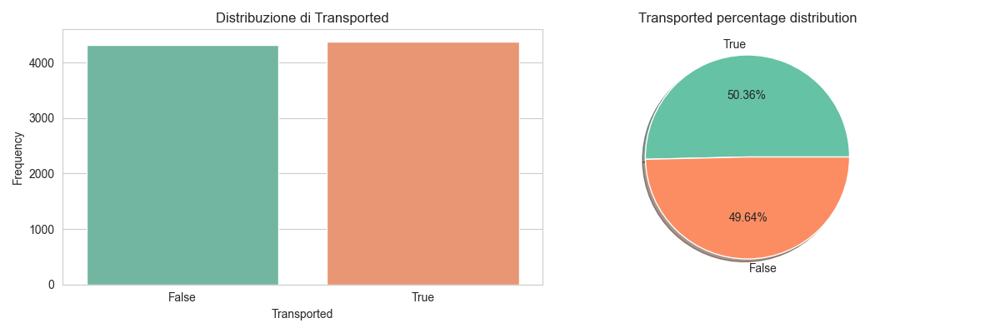
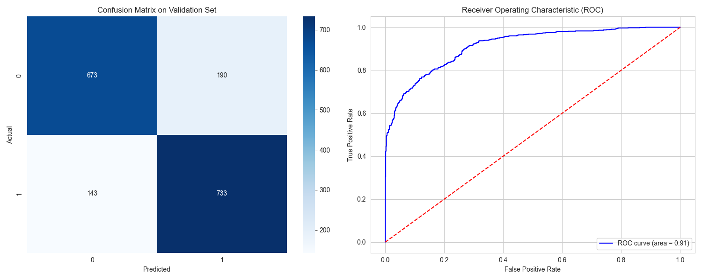
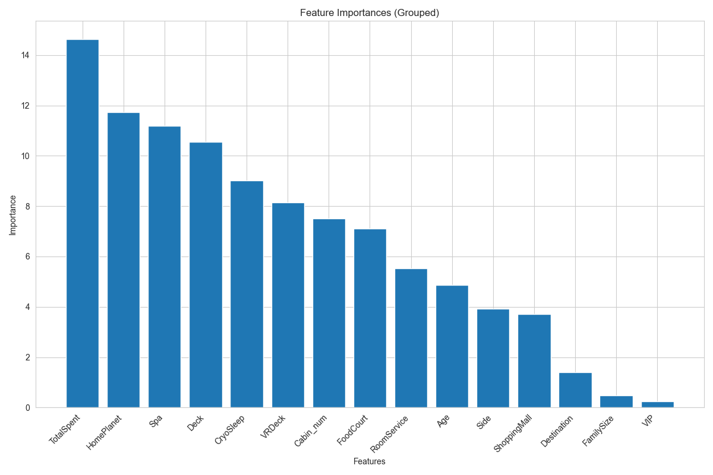

# FIA Project - Spaceship Titanic Project

A machine learning project for the Spaceship Titanic competition that predicts whether a passenger was transported to an alternate dimension using various classification algorithms.

## 📁 Project Structure

```
Progetto_FIA_Spaceship_Project/
├── data/
│   ├── train.csv                 # Training dataset
│   ├── test.csv                  # Test dataset
│   └── submission_*.csv          # Generated submission files
├── src/
│   ├── main.py                   # Main script to run the project
│   ├── preliminar_operations.py  # Preliminary operations and data splitting
│   ├── model_factory.py          # Factory for preprocessing, model creation and training
│   ├── testing.py                # Testing and prediction generation
│   ├── custom_transformers.py     # Script for additional logical imputations based on the domain of the problem
|   └── EDA.py                    # Script for Exploratory Data Analysis
├── models/                       # Saved models (.joblib)
└── plots/                        # Graphs and visualizations

## 🚀 How to Use the Project

### Prerequisites
```bash
pip install pandas numpy scikit-learn xgboost catboost joblib matplotlib seaborn
```

### Execution
1. Navigate to the `src/` folder
2. Run the main script:
```bash
cd src
python main.py
```

### Interactive Workflow
The program will guide you through the following phases:

1. **Data Loading**: The system automatically loads raw data and prepares it for the pipeline (it asks also asks if EDA can be performed or not)
2. **Model Selection**: Choose from 6 available algorithms:
   - `1`: Random Forest
   - `2`: AdaBoost  
   - `3`: SVM
   - `4`: XGBoost
   - `5`: CatBoost
   - `6`: Stacked Classifier

3. **Training/Loading**: 
   - If the model already exists, it is loaded automatically
   - Otherwise it is trained from scratch with the pipeline (in which the numerical imputation (mean/KNNImputer) and the numerical scaling (standardization/normalization) can be choosed)

4. **Saving**: Option to save the trained model
5. **Testing**: Option to test the model on test data and generate submission

## 🧠 Implemented Models

| Model | Description | Saved File |
|-------|-------------|------------|
| **Random Forest** | Ensemble of decision trees | `RandomForest_model_new_pipeline.joblib` |
| **AdaBoost** | Adaptive Boosting | `AdaBoost_model_new_pipeline.joblib` |
| **SVM** | Support Vector Machine | `SVM_model_new_pipeline.joblib` |
| **XGBoost** | Extreme Gradient Boosting | `XGBoost_model_new_pipeline.joblib` |
| **CatBoost** | Categorical Boosting | `CatBoost_model_new_pipeline.joblib` |
| **Stacked Classifier** | Ensemble of multiple models | `StackedClassifier_model_new_pipeline.joblib` |

## 🔧 System Architecture

### Main Components

1. **`PreliminarOperations`**: 
   - Handles loading and initial splitting of data into training and validation set (Holdout)
   - `get_raw_data_for_pipeline()` method to get data ready for the pipeline

2. **`ModelFactory`**: 
   - Factory pattern for model creation
   - `train_and_evaluate_model()` method for training and evaluation

3. **`Testing`**: 
   - Handles testing on test data
   - Generates submission files for the Kaggle competition

### Preprocessing Pipeline
The system implements a "pipeline" that includes:
- **Feature Engineering** during training to handle features, to create new ones ecc.
- **Logical Imputations** to handle missing values
- **Classical Preprocessing** to handle remaing missing values (mean/KNNImputer, mode, normalization/standardization, one-hot endconding)

### Hyper-parameter Tuning
The system includes a dedicated hyper-parameter tuning module. For most models, it uses GridSearch with stratified cross-validation, applying the previously defined preprocessing pipeline to the training set (split using Holdout). For CatBoost, which is particularly well-suited to this dataset, RandomizedSearch is used instead. This training set is then used to train the specified model. This approach ensures optimal parameter selection for each model while maintaining robust validation.

## 📊 Dataset - Spaceship Titanic

The dataset contains information about spaceship passengers, with the goal of predicting whether they were transported to an alternate dimension.

### Main Features:
- **PassengerId**: Unique identifier for each passenger
- **HomePlanet**: Planet of origin (Earth, Europa, Mars)
- **CryoSleep**: Whether passenger was in cryogenic sleep
- **Cabin**: Cabin number in format deck/num/side
- **Destination**: Destination planet (TRAPPIST-1e, 55 Cancri e, PSO J318.5-22)
- **Age**: Age of the passenger
- **VIP**: Whether passenger paid for VIP service
- **RoomService**: Amount billed for room service
- **FoodCourt**: Amount billed for food court
- **ShoppingMall**: Amount billed for shopping mall
- **Spa**: Amount billed for spa
- **VRDeck**: Amount billed for VR deck
- **Name**: Passenger name
- **Transported**: Target variable (whether transported to alternate dimension)

## 🎯 Features

- ✅ **Multiple model system** with interactive selection
- ✅ **Automatic loading** of pre-trained models
- ✅ **Advanced preprocessing pipeline**
- ✅ **Model saving/loading** with joblib
- ✅ **Automatic testing** and submission generation
- ✅ **Error handling** and user-friendly workflow

## 📈 Typical Usage

```python
# Example of programmatic usage
from preliminar_operations import PreliminarOperations
from model_factory import ModelFactory
from testing import Testing

# 1. Data preparation
preliminar_ops = PreliminarOperations()
X_train, X_val, y_train, y_val = preliminar_ops.get_raw_data_for_pipeline()

# 2. Model training
model_factory = ModelFactory()
model = model_factory.train_and_evaluate_model('2', X_train, y_train, X_val, y_val)

# 3. Testing
testing = Testing()
testing.test_model(model)
```

## 🏆 Results

Models are saved in the `models/` folder and predictions in the `data/` folder as CSV files ready for Kaggle competition submission.
Plots visualized can be saved, EDA plots (if EDA is executed) are saved automatically in `plots/`

### Sample Visualizations

Below are examples of 3 analysis plots generated:

Transpported Univariate distribution generated by EDA:


Catboost Confusion Matrix and ROC curve


Catboost Feature Importances:



## 👨‍💻 Development

Project developed for the Fundamentals of Artificial Intelligence course, implementing best practices of:
- Design Patterns (Factory)
- Code modularity
- Reusable ML pipelines
- User-friendly interactive management

---

*For questions or issues, verify that all modules are correctly importable and that datasets are present in the `data/` folder.*
*There are already pre-trained model (MinMax Scaling and KNNImputer were chosen) in the `models/` directory, feel free to delete some if you want to train a new model"
